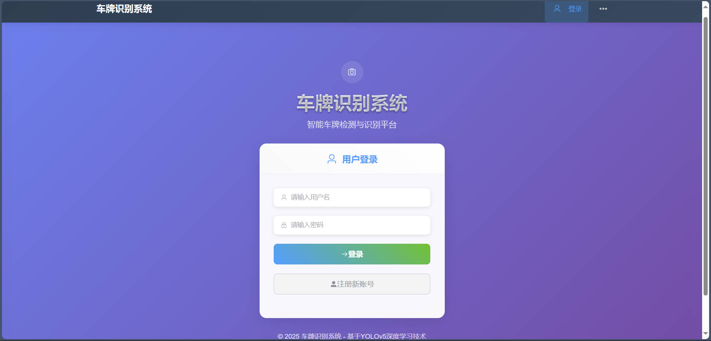
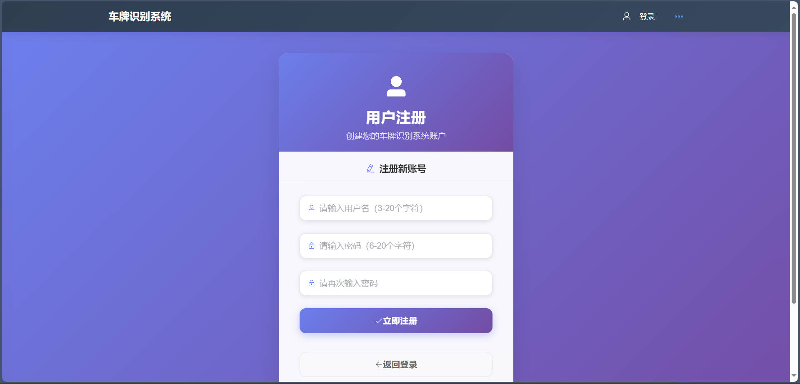
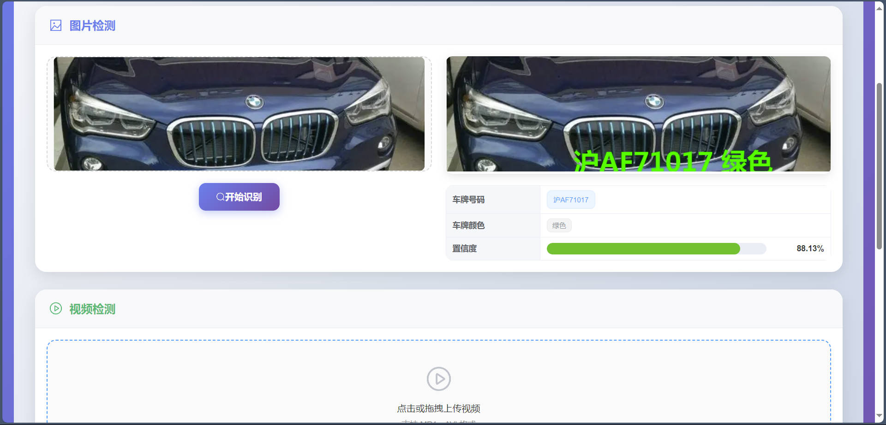
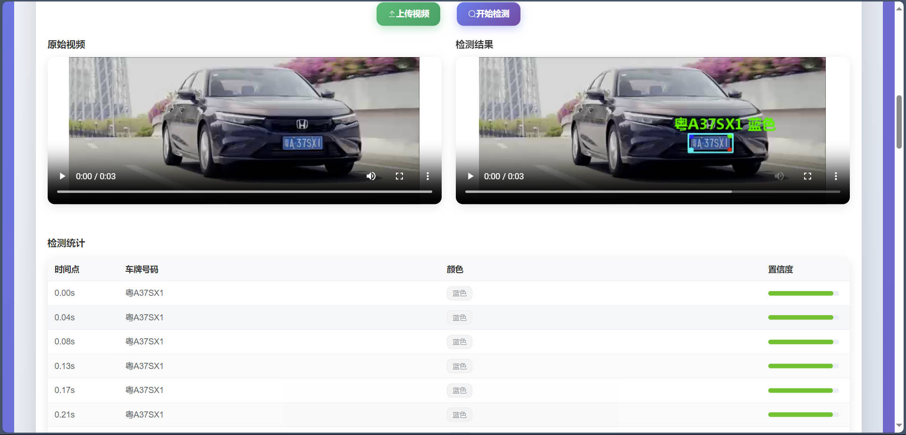
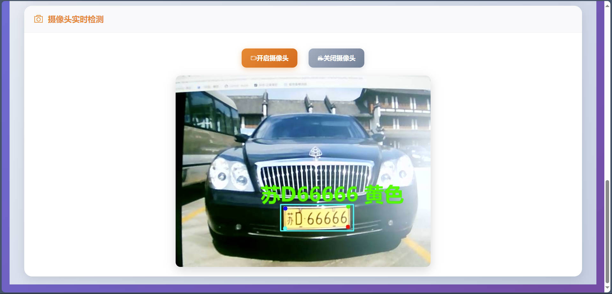
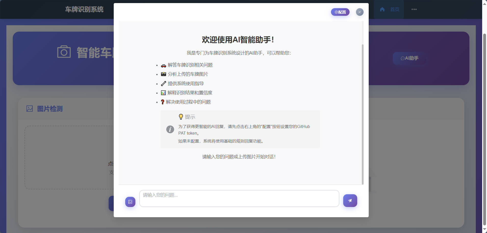
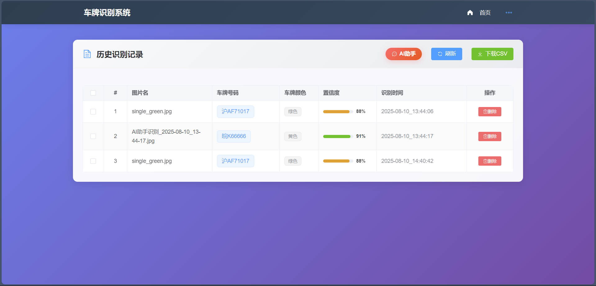

# YOLOv5 车牌检测识别系统

[English Version](README_EN.md)

一个基于YOLOv5的智能车牌检测识别系统，集成了现代化的Web界面和AI对话功能。

## 📸 项目展示

### 用户认证
<div align="center">
  
  
</div>

### 车牌检测功能
<div align="center">
  
  
  
</div>

### 智能功能
<div align="center">
  
  
</div>

##  功能特性

### 核心功能
- **车牌检测识别**：基于YOLOv5和ONNX模型的高精度车牌检测
- **多格式支持**：支持图片和视频文件的车牌识别
- **实时处理**：快速的图像处理和识别响应
- **历史记录**：完整的识别历史记录和数据管理

### 智能AI功能
- **AI对话助手**：集成GitHub模型API的智能对话功能
- **多模态输入**：支持文本和图片输入的AI对话
- **智能降级**：网络问题时自动切换到本地智能回复
- **配置管理**：灵活的AI模型配置和管理

### 用户系统
- **用户注册登录**：完整的用户认证系统
- **权限管理**：管理员和普通用户权限控制
- **数据隔离**：用户数据安全隔离

##  技术栈

### 后端
- **Python Flask**：轻量级Web框架
- **YOLOv5**：目标检测模型
- **ONNX Runtime**：模型推理引擎
- **OpenCV**：图像处理
- **SQLite**：数据库
- **Flask-CORS**：跨域支持

### 前端
- **Vue.js 3**：现代化前端框架
- **Vue Router**：路由管理
- **Axios**：HTTP客户端
- **Element Plus**：UI组件库
- **现代化设计**：响应式布局和美观界面

## 📁 项目结构

```
YOLOv5-Car-Detection-System/
├── backend/                 # 后端服务
│   ├── app.py              # Flask应用主文件
│   ├── onnx_infer.py       # ONNX模型推理
│   ├── requirements.txt    # Python依赖
│   ├── model/              # 模型文件
│   │   ├── plate_detect.onnx
│   │   └── plate_rec_color.onnx
│   ├── static/             # 静态文件
│   ├── fonts/              # 字体文件
│   │   └── platech.ttf
│   └── users.db            # 用户数据库
├── frontend/               # 前端应用
│   ├── src/
│   │   ├── components/     # Vue组件
│   │   │   ├── AiChat.vue  # AI对话组件
│   │   │   └── AiConfig.vue # AI配置组件
│   │   ├── views/          # 页面视图
│   │   ├── router/         # 路由配置
│   │   └── main.js         # 应用入口
│   ├── package.json        # 前端依赖
│   └── vue.config.js       # Vue配置
├── material/               # 测试素材
│   ├── imgs/               # 测试图片
│   │   ├── 0.jpg           # 车牌测试图片
│   │   ├── 1.jpg           # 车牌测试图片
│   │   ├── 6.jpg           # 车牌测试图片
│   │   ├── double_yellow.jpg # 双黄牌测试
│   │   ├── single_green.jpg  # 单绿牌测试
│   │   ├── single_yellow.jpg # 单黄牌测试
│   │   └── ...             # 其他测试图片
│   └── test.mp4            # 测试视频文件
├── rendering/              # 项目效果图
│   ├── login.jpg           # 登录页面截图
│   ├── register.jpg        # 注册页面截图
│   ├── image-detection.jpg # 图片检测截图
│   ├── video-detection.jpg # 视频检测截图
│   ├── ai-assistant.jpg    # AI助手截图
│   └── history.jpg         # 历史记录截图
└── README.md               # 项目说明
```

##  快速开始

### 环境要求
- Python 3.8+
- Node.js 14+
- npm 或 yarn

### 后端安装

1. 进入后端目录
`bash
cd backend
`

2. 创建虚拟环境（推荐）
```bash
python -m venv venv
```

**激活虚拟环境**

**Windows**
```powershell
venc\Scripts\activate
```

**Linux/Mac**
```bash
source venv/bin/activate
```

3. 安装依赖
`bash
pip install -r requirements.txt
`

4. 启动后端服务
`bash
python app.py
`

后端服务将在 http://localhost:5002 启动

### 前端安装

1. 进入前端目录
`bash
cd frontend
`

2. 安装依赖
`bash
npm install
`

3. 启动开发服务器
`bash
npm run serve
`

前端应用将在 http://localhost:8080 启动

##  使用说明

### 基本使用流程

1. **用户注册/登录**
   - 访问前端应用
   - 注册新用户或使用现有账户登录

2. **车牌识别**
   - 上传图片或视频文件
   - 系统自动检测和识别车牌
   - 查看识别结果和详细信息

3. **AI对话功能**
   - 点击AI对话按钮
   - 配置GitHub模型（可选）
   - 开始智能对话，支持文本和图片输入

4. **历史记录**
   - 查看所有识别历史
   - 管理和导出数据

### 测试素材使用

项目提供了丰富的测试素材供您快速体验系统功能：

**测试图片**（位于 `material/imgs/` 目录）：
- `0.jpg`, `1.jpg`, `6.jpg` - 基础车牌测试图片
- `double_yellow.jpg` - 双黄牌测试（大型车辆）
- `single_green.jpg` - 单绿牌测试（新能源车辆）
- `single_yellow.jpg` - 单黄牌测试（普通车辆）
- `hongkang1.jpg` - 港澳车牌测试
- `moto.png` - 摩托车牌测试

**测试视频**：
- `material/test.mp4` - 车牌检测视频测试文件

**使用方法**：
1. 启动系统后，在图片检测页面选择 `material/imgs/` 中的任意图片进行测试
2. 在视频检测页面上传 `material/test.mp4` 进行视频检测测试
3. 观察不同类型车牌的识别效果和准确率

### AI功能配置

1. **GitHub模型配置**
   - 获取GitHub Personal Access Token
   - 在AI配置页面输入Token和模型名称
   - 保存配置后即可使用GitHub模型

2. **本地智能回复**
   - 无需配置，系统自动提供
   - 网络问题时自动降级使用

##  配置说明

### 后端配置
- 模型文件路径：`backend/model/`
- 静态文件路径：`backend/static/`
- 数据库文件：`backend/users.db`

### 前端配置
- API基础URL：在 `frontend/src/main.js` 中配置
- 路由配置：`frontend/src/router/index.js`

##  AI功能详解

### GitHub模型集成
- 支持GitHub Models API
- 多种模型选择（GPT-4o, Claude等）
- 智能对话和图像理解

### 本地智能回复
- 基于规则的智能回复系统
- 车牌识别相关问题解答
- 系统使用指导

### 降级机制
- 网络问题自动检测
- 无缝切换到本地回复
- 用户友好的错误提示

##  API接口

### 车牌识别API
- POST /api/upload - 图片上传和识别
- POST /api/upload_video - 视频上传和识别
- GET /api/history - 获取识别历史

### AI功能API
- POST /api/ai_config - AI配置保存
- POST /api/ai_chat - AI对话接口

### 用户管理API
- POST /api/register - 用户注册
- POST /api/login - 用户登录
- POST /api/logout - 用户登出

##  安全特性

- 用户认证和会话管理
- 文件上传安全检查
- SQL注入防护
- XSS攻击防护
- CORS跨域安全配置

##  部署建议

### 开发环境
- 使用Flask开发服务器
- Vue.js开发模式
- 热重载支持

### 生产环境
- 使用Gunicorn或uWSGI部署Flask应用
- 使用Nginx作为反向代理
- 构建Vue.js生产版本
- 配置HTTPS和安全头

##  贡献指南

1. Fork 项目
2. 创建功能分支 (git checkout -b feature/AmazingFeature)
3. 提交更改 (git commit -m 'Add some AmazingFeature')
4. 推送到分支 (git push origin feature/AmazingFeature)
5. 开启 Pull Request

## 更新日志

### v1.0.0 (2025-08-9)
- 初始版本发布
- 车牌检测识别功能
- Web界面和用户系统
- AI对话功能集成
- 智能降级机制

### v1.0.1 (2025-08-10)
- **修复**：统一前端API请求路径，解决部分功能404错误（涉及 `Admin.vue`, `Register.vue`, `Login.vue`, `Home.vue`）
- **修复**：解决历史记录中AI助手识别结果中文乱码问题，统一CSV文件编码为UTF-8（涉及 `backend/app.py` 中所有CSV读写操作）
- **修复**：解决历史记录获取时因CSV表头重复写入导致的500错误，优化CSV文件初始化和图片检测API中的表头写入逻辑
- **优化**：更新 `README.md` 中虚拟环境创建和激活的说明格式，使其更清晰易读

##  许可证

本项目采用 MIT 许可证 - 查看 [LICENSE](LICENSE) 文件了解详情

##  致谢

- YOLOv5 团队提供的优秀目标检测模型
- Vue.js 社区的前端框架支持
- Flask 社区的后端框架支持
- 所有贡献者和用户的支持

##  联系方式

如有问题或建议，请通过以下方式联系：

- 提交 Issue
- 发起 Pull Request
- 邮件联系：[912811339@qq.com]

---

 如果这个项目对您有帮助，请给它一个星标！
