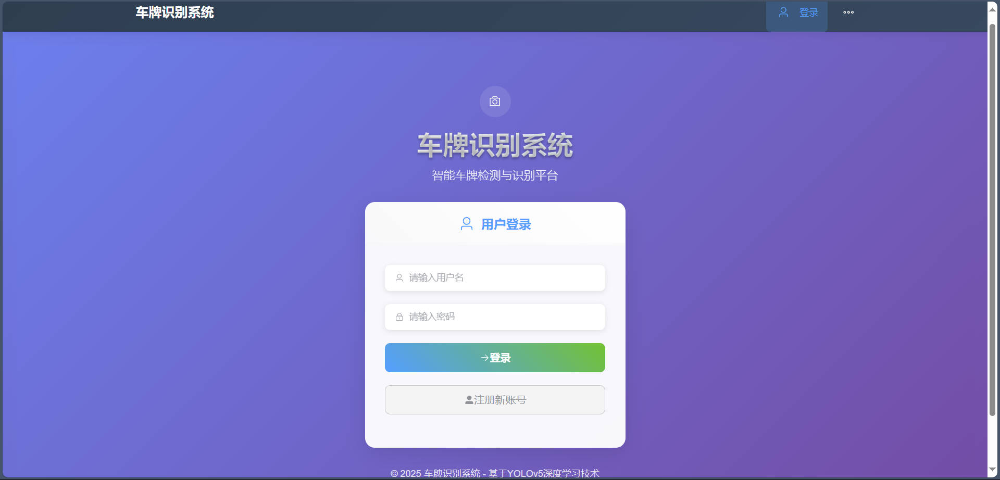
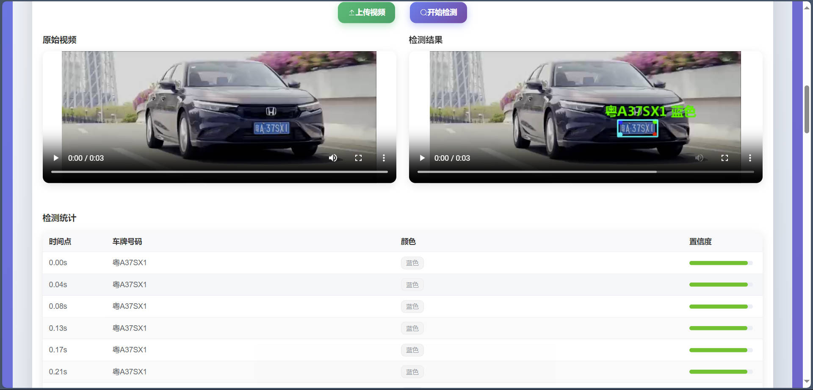

# YOLOv5 Car Plate Detection and Recognition System

[中文版本](README.md)

A smart car plate detection and recognition system based on YOLOv5, integrated with a modern Web interface and AI conversation features.

## 📸 Project Screenshots

### User Authentication
<div align="center">
  
  
</div>

### License Plate Detection
<div align="center">
  
  
</div>

### Smart Features
<div align="center">
  
  
</div>

## Features

### Core Features
- **License Plate Detection and Recognition**: High-precision license plate detection based on YOLOv5 and ONNX models.
- **Multi-format Support**: Supports license plate recognition from image and video files.
- **Real-time Processing**: Fast image processing and recognition response.
- **History Records**: Complete recognition history and data management.

### Smart AI Features
- **AI Chat Assistant**: Integrated smart conversation feature using GitHub model API.
- **Multi-modal Input**: Supports text and image input for AI conversations.
- **Intelligent Degradation**: Automatically switches to local smart replies when network issues occur.
- **Configuration Management**: Flexible AI model configuration and management.

### User System
- **User Registration and Login**: Complete user authentication system.
- **Permission Management**: Admin and regular user permission control.
- **Data Isolation**: Secure isolation of user data.

## Tech Stack

### Backend
- **Python Flask**: Lightweight Web framework.
- **YOLOv5**: Object detection model.
- **ONNX Runtime**: Model inference engine.
- **OpenCV**: Image processing.
- **SQLite**: Database.
- **Flask-CORS**: Cross-origin support.

### Frontend
- **Vue.js 3**: Modern frontend framework.
- **Vue Router**: Routing management.
- **Axios**: HTTP client.
- **Element Plus**: UI component library.
- **Modern Design**: Responsive layout and aesthetic interface.

## 📁 Project Structure

```
YOLOv5-Car-Detection-System/
├── backend/                 # Backend services
│   ├── app.py              # Flask application main file
│   ├── onnx_infer.py       # ONNX model inference
│   ├── requirements.txt    # Python dependencies
│   ├── model/              # Model files
│   │   ├── plate_detect.onnx
│   │   └── plate_rec_color.onnx
│   ├── static/             # Static files
│   ├── fonts/              # Font files
│   │   └── platech.ttf
│   └── users.db            # User database
├── frontend/               # Frontend application
│   ├── src/
│   │   ├── components/     # Vue components
│   │   │   ├── AiChat.vue  # AI chat component
│   │   │   └── AiConfig.vue # AI config component
│   │   ├── views/          # Page views
│   │   ├── router/         # Router configuration
│   │   └── main.js         # Application entry point
│   ├── package.json        # Frontend dependencies
│   └── vue.config.js       # Vue configuration
├── material/               # Test materials
│   ├── imgs/               # Test images
│   │   ├── 0.jpg           # License plate test image
│   │   ├── 1.jpg           # License plate test image
│   │   ├── 6.jpg           # License plate test image
│   │   ├── double_yellow.jpg # Double yellow plate test
│   │   ├── single_green.jpg  # Single green plate test
│   │   ├── single_yellow.jpg # Single yellow plate test
│   │   └── ...             # Other test images
│   └── test.mp4            # Test video file
├── rendering/              # Project screenshots
│   ├── login.jpg           # Login page screenshot
│   ├── register.jpg        # Register page screenshot
│   ├── image-detection.jpg # Image detection screenshot
│   ├── video-detection.jpg # Video detection screenshot
│   ├── ai-assistant.jpg    # AI assistant screenshot
│   └── history.jpg         # History records screenshot
└── README.md               # Project README
```

## Quick Start

### Environment Requirements
- Python 3.8+
- Node.js 14+
- npm or yarn

### Backend Installation

1. Enter the backend directory
```bash
cd backend
```

2. Create a virtual environment (recommended)
```bash
python -m venv venv
```

**Activate the virtual environment**

**Windows**
```powershell
venc\Scripts\activate
```

**Linux/Mac**
```bash
source venv/bin/activate
```

3. Install dependencies
```bash
pip install -r requirements.txt
```

4. Start the backend service
```bash
python app.py
```

The backend service will start at http://localhost:5002

### Frontend Installation

1. Enter the frontend directory
```bash
cd frontend
```

2. Install dependencies
```bash
npm install
```

3. Start the development server
```bash
npm run serve
```

The frontend application will start at http://localhost:8080

## Usage Guide

### Basic Usage Flow

1. **User Registration/Login**
   - Access the frontend application.
   - Register a new user or log in with an existing account.

2. **License Plate Recognition**
   - Upload image or video files.
   - The system automatically detects and recognizes license plates.
   - View recognition results and detailed information.

3. **AI Chat Feature**
   - Click the AI chat button.
   - Configure the GitHub model (optional).
   - Start intelligent conversations, supporting text and image input.

4. **History Records**
   - View all recognition history.
   - Manage and export data.

### Test Materials Usage

The project provides rich test materials for you to quickly experience the system features:

**Test Images** (located in `material/imgs/` directory):
- `0.jpg`, `1.jpg`, `6.jpg` - Basic license plate test images
- `double_yellow.jpg` - Double yellow plate test (large vehicles)
- `single_green.jpg` - Single green plate test (new energy vehicles)
- `single_yellow.jpg` - Single yellow plate test (regular vehicles)
- `hongkang1.jpg` - Hong Kong/Macau license plate test
- `moto.png` - Motorcycle plate test

**Test Video**:
- `material/test.mp4` - License plate detection video test file

**Usage Instructions**:
1. After starting the system, select any image from `material/imgs/` on the image detection page for testing
2. Upload `material/test.mp4` on the video detection page for video detection testing
3. Observe the recognition effects and accuracy of different types of license plates

### AI Feature Configuration

1. **GitHub Model Configuration**
   - Obtain a GitHub Personal Access Token.
   - Enter the Token and model name on the AI configuration page.
   - Save the configuration to use the GitHub model.

2. **Local Smart Reply**
   - No configuration required, automatically provided by the system.
   - Automatically degrades to local replies when network issues occur.

## Configuration Details

### Backend Configuration
- Model file path: `backend/model/`
- Static file path: `backend/static/`
- Database file: `backend/users.db`

### Frontend Configuration
- API base URL: Configured in `frontend/src/main.js`.
- Routing configuration: `frontend/src/router/index.js`.

## AI Feature Deep Dive

### GitHub Model Integration
- Supports GitHub Models API.
- Multiple model choices (GPT-4o, Claude, etc.).
- Intelligent conversation and image understanding.

### Local Smart Reply
- Rule-based intelligent reply system.
- Answers to license plate recognition related questions.
- System usage guidance.

### Degradation Mechanism
- Automatic network issue detection.
- Seamless switching to local replies.
- User-friendly error prompts.

## API Endpoints

### License Plate Recognition API
- POST /api/upload - Image upload and recognition.
- POST /api/upload_video - Video upload and recognition.
- GET /api/history - Get recognition history.

### AI Feature API
- POST /api/ai_config - AI configuration saving.
- POST /api/ai_chat - AI chat interface.

### User Management API
- POST /api/register - User registration.
- POST /api/login - User login.
- POST /api/logout - User logout.

## Security Features

- User authentication and session management.
- File upload security checks.
- SQL injection prevention.
- XSS attack prevention.
- CORS cross-origin security configuration.

## Deployment Suggestions

### Development Environment
- Use Flask development server.
- Vue.js development mode.
- Hot reload support.

### Production Environment
- Use Gunicorn or uWSGI to deploy Flask application.
- Use Nginx as a reverse proxy.
- Build Vue.js production version.
- Configure HTTPS and security headers.

## Contribution Guide

1. Fork the project.
2. Create your feature branch (`git checkout -b feature/AmazingFeature`).
3. Commit your changes (`git commit -m 'Add some AmazingFeature'`).
4. Push to the branch (`git push origin feature/AmazingFeature`).
5. Open a Pull Request.

## Changelog

### v1.0.0 (2025-08-9)
- Initial version release.
- License plate detection and recognition feature.
- Web interface and user system.
- AI conversation feature integration.
- Intelligent degradation mechanism.

### v1.0.1 (2025-08-10)
- **Fix**: Unified frontend API request paths, resolved 404 errors for some functions (affecting `Admin.vue`, `Register.vue`, `Login.vue`, `Home.vue`).
- **Fix**: Resolved Chinese garbled characters in AI assistant recognition results in history, unified CSV file encoding to UTF-8 (affecting all CSV read/write operations in `backend/app.py`).
- **Fix**: Resolved 500 error when fetching history due to duplicate CSV headers, optimized CSV file initialization and header writing logic in image detection API.
- **Optimization**: Updated the format of virtual environment creation and activation instructions in `README.md` for better clarity and readability.

## License

This project is licensed under the MIT License - see the [LICENSE](LICENSE) file for details.

## Acknowledgements

- YOLOv5 team for providing an excellent object detection model.
- Vue.js community for frontend framework support.
- Flask community for backend framework support.